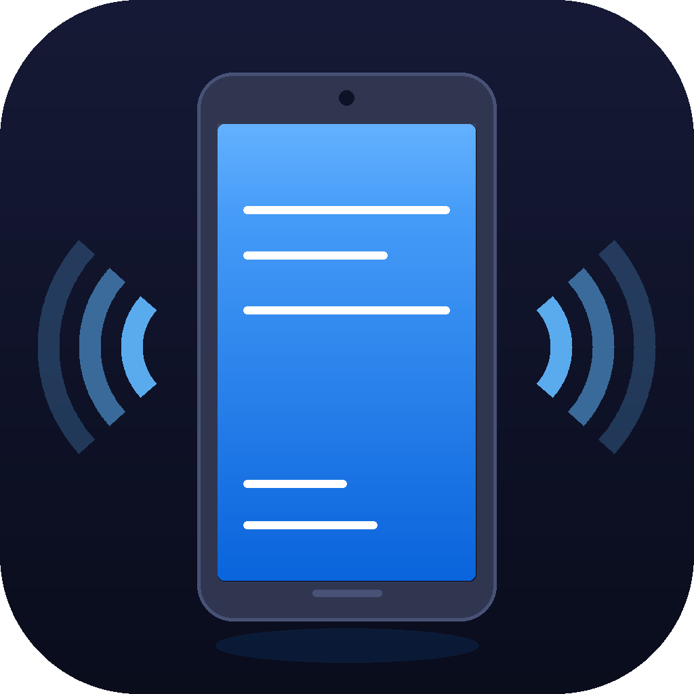

# iPad Mirror

Mirror your iPad screen to your Mac or Windows PC over USB — no AirPlay, no Wi-Fi needed.



## Features

- **Wired USB mirroring** — low latency, no network required
- **Fit / Fill modes** — show the full iPad screen (letterbox) or crop-to-fill like Apple TV
- **Fullscreen support** — double-click or press F
- **Always-on-top** — pin the window above other apps
- **Dark UI** — native macOS dark mode appearance
- **macOS + Windows** — packaged as `.app` and `.exe`

## Requirements

### iPad
- iOS 17 or later
- **Developer Mode ON** → Settings → Privacy & Security → Developer Mode
- Connected via USB and "Trust" accepted on the iPad

### Mac
- macOS 12 (Monterey) or later
- Mac login password (used once to start the secure RSD tunnel via `sudo`)

### Windows
- Windows 10 or later
- **iTunes installed** (provides Apple USB drivers) — [Microsoft Store](https://apps.microsoft.com/store/detail/itunes/9PB2MZ1ZMB1S) or [apple.com](https://www.apple.com/itunes/)
- Run the app as **Administrator** (the installer handles this automatically)

## Installation

### macOS

1. Download `iPad Mirror.app` from [Releases](../../releases)
2. First launch: **right-click → Open** (bypasses Gatekeeper for unsigned apps)
3. From then on, double-click works normally

Or remove the quarantine flag via Terminal:
```bash
xattr -dr com.apple.quarantine "/path/to/iPad Mirror.app"
```

### Windows

1. Download `iPad_Mirror_Setup.exe` from [Releases](../../releases)
2. Run the installer — it will prompt for Administrator access (UAC)
3. Launch from the Desktop or Start Menu shortcut

## Building from Source

### Mac
```bash
git clone https://github.com/ashish-kumar-j/ipad-mirror.git
cd ipad-mirror
bash build_mac.sh
# Output: dist/iPad Mirror.app
```

### Windows
```bat
git clone https://github.com/ashish-kumar-j/ipad-mirror.git
cd ipad-mirror
build_windows.bat
# Output: dist\iPad Mirror.exe  and  dist\iPad_Mirror_Setup.exe
```

**Build dependencies (auto-installed by the build scripts):**
- Python 3.10+
- PyQt6
- pymobiledevice3
- Pillow
- PyInstaller
- [Inno Setup 6](https://jrsoftware.org/isdl.php) *(Windows installer only)*

## How It Works

iPad Mirror uses Apple's **RemoteServiceDiscovery (RSD)** protocol introduced in iOS 17, combined with the **DVT instruments** service to capture screenshots at up to ~10 fps.

On iOS 17+, a secure RSD tunnel must be established first:
- **macOS**: the app runs `sudo pymobiledevice3 remote start-tunnel` and asks for your password once per session
- **Windows**: the app must run as Administrator; no password prompt

The tunnel provides an IPv6 loopback address and port that the screenshot service connects through.

## Troubleshooting

**"No device found" / tunnel fails**
- Make sure Developer Mode is enabled on the iPad
- Unplug and replug the USB cable, tap "Trust" on the iPad
- Kill any existing tunnel: `sudo pkill -f start-tunnel`

**Black screen after connecting**
- The DVT screenshot service requires Developer Mode; double-check it's enabled
- Try stopping and starting mirroring again

**macOS security warning**
- Right-click the app → Open, then click Open in the dialog

## License

MIT
